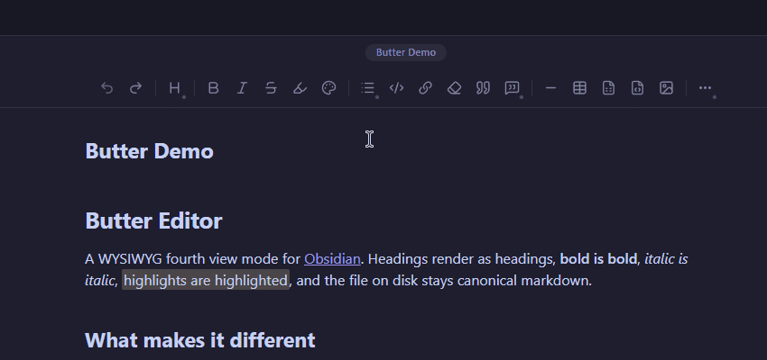
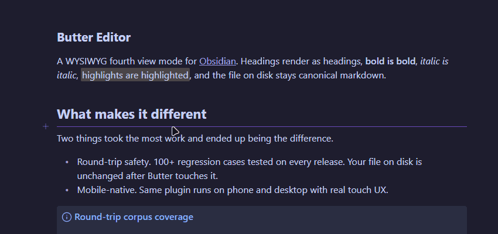
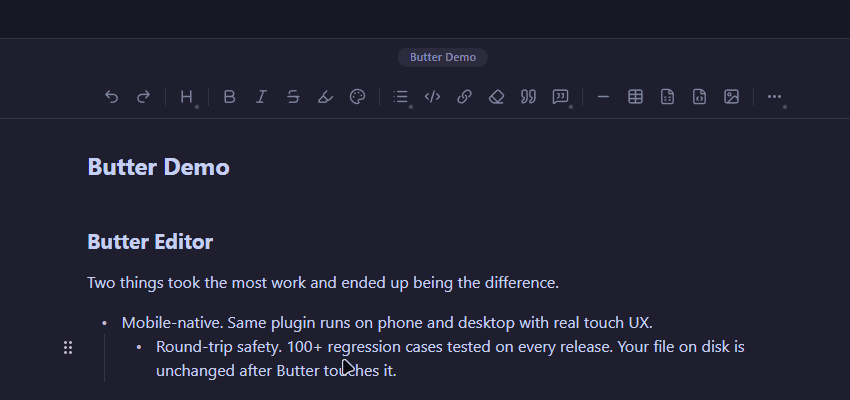
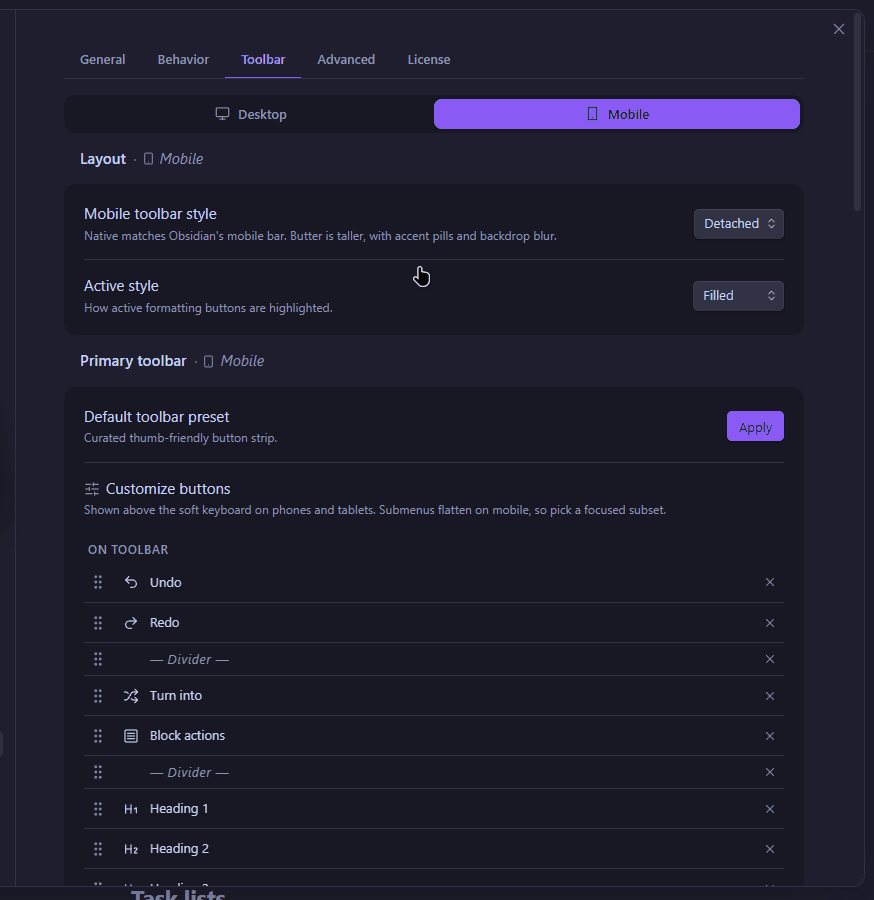

# Butter Editor

A *true* WYSIWYG editing mode for [Obsidian](https://obsidian.md). You'll get an additional mode that gives a rich text editing experience all while still preserving your markdown in the background. Runs locally on desktop and mobile!

Butter is a paid plugin. **Free 15-day trial (*no email or credit card required*)**. One-time purchase for a lifetime license (yours to keep, forever) covering all v1 updates (v1 also includes all beta releases).

**Buy:** [buttereditor.com](https://buttereditor.com) · **Manage your licenses:** [licenses.buttereditor.com](https://licenses.buttereditor.com)

## Key Features

- **Edit and style your notes freely** without seeing raw markdown (including with color!)
- **Fully supports Obsidian syntax** and common features like **Wikilinks**, **Callouts**, **Bases** and more.
- **Your files stay compatible** with any markdown software. Clean source that won't drift between editors.
- **Drag & drop blocks** to reorder your notes easily.
- **Use slash commands** '/' to quickly add anything.
- **Works on your phone and desktop** (same plugin, same license for all your devices).
- **Customizable toolbar** to get buttons and tools just where you like them.
- Switch between different viewing modes seamlessly. Butter editor lives alongside Source, Live Preview, and Reading modes.

## Installation

Butter Editor is available directly from the Obsidian Community Plugins directory.
1. Open Obsidian **Settings** → **Community plugins**.
2. Turn off "Safe mode".
3. Click **Browse** and search for "Butter Editor".
4. Click **Install**, then **Enable**.

*To install manually:* Download the latest release from GitHub and place `main.js`, `manifest.json`, and `styles.css` into your `.obsidian/plugins/butter-editor/` folder.

## Usage

1. Open any note in Obsidian.
2. Click the Butter icon in the top right view header (or use the Command Palette: `Butter Editor: Toggle view`).
3. Your note is now in Butter mode! Type `/` on a new line to open the slash menu and start editing.
4. *Note: If this is your first time, you will be prompted to start a free 15-day trial or enter your license key.*

## Network use and privacy

Butter Editor will use the following information for license validation purposes only:

- Your email (For license purchase, receipts, and license recovery)
- List of devices on your license (Up to 5)
- Your license key

There is no analytics service, no telemetry pipeline, no third-party tracker. The plugin runs locally. Full data-handling details are in the [privacy policy](https://buttereditor.com/privacy).

Two URLs, in case you need them for a firewall:

- `api.buttereditor.com` (license validation)
- `licenses.buttereditor.com` (manage your license in browser)

## Third-party code

Butter bundles two open-source libraries:

- [ProseMirror](https://prosemirror.net/) (MIT), the editor toolkit.
- [markdown-it](https://github.com/markdown-it/markdown-it) (MIT), the markdown parser.

Their licenses are preserved in the plugin. Everything else is original Butter Editor code.

## Support

- Bug reports and feature requests: [GitHub Issues](https://github.com/spreadwell/butter-editor/issues)
- Email: support@buttereditor.com
- Billing and devices: [licenses.buttereditor.com](https://licenses.buttereditor.com)

## License

Butter Editor is source-available proprietary software. The source is published in this repository under the [LICENSE](./LICENSE), which permits private use, internal organizational use, and custom one-off implementations, but restricts use as a substantial component of a competing Obsidian product. Runtime use is governed by the End User License Agreement at [buttereditor.com/terms](https://buttereditor.com/terms) and requires a valid Butter Editor license (or an active trial).
